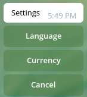
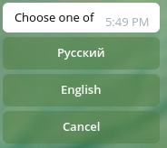
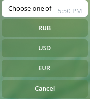
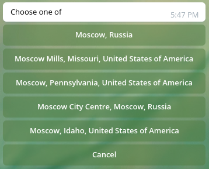
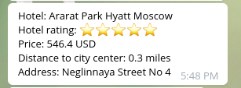

# Поиск отелей в Telegram

Этот бот позволяет быстро подбирать отели прямо в мессенджере Telegram по различным критериям поиска. 
Попробуйте использовать бот: https://t.me/hoteline_bot 

## Особенности

Данный бот позволяет:
* подбирать отели по самой низкой или высокой цене;
* подбирать отели по лучшему соотношению цена/расстояние от центра города;  
* задавать количество выводимых отелей;  
* задавать диапазон цен.
* Бот не использует и не запрашивает никакие персональные данные.
* Двуязычная поддержка, зависимая от `language_code` от Telegram Bot API. 
  Так же есть возможность принудительного изменения языка в независимости от `language_code` 

## Requirements

* Python 3.7+
* [PyTelegramBotAPI](https://github.com/python-telegram-bot/python-telegram-bot) – Python Telegram Bot API
* [requests](https://github.com/psf/requests) - библиотека requests
* [redis](https://redis.io/) - хранилище поисковых параметров каждого пользователя

Вы можете установить все зависимости, выполнив следующую команду: `pip install -r requirements.txt`

## Логирование

В скрипте этого бота используется модуль [loguru](https://github.com/Delgan/loguru) для логирования. 
Вы можете настроить параметры логирования отредактировав `logger_config`:

```python
from loguru import logger
logger_config = {
    "handlers": [
        {
            "sink": "logs/bot.log", 
            "format": "{time} | {level} | {message}", 
            "encoding": "utf-8", 
            "level": "DEBUG",
            "rotation": "1 MB", 
            "compression": "zip"
        },
    ],
}
logger.configure(**logger_config)
```

## Команды бота

* `/start` - запуск бота, выполняется автоматически при подключении к боту.
* `/help` - список команд и их описание
* `/lowprice` - топ дешевых отелей
* `/highprice` - топ дорогих отелей
* `/bestdeal` - лучшие предложения
* `/settings` - меню с настройками  

## Как работать с ботом Hoteline

Список всех команд, поддерживаемых ботом, можно посмотреть по команде `/help`
Команда `/settings` показывает меню настроек, 



где вы можете выбрать язык поиска (по умолчанию соответствует значению `language_code` от Telegram Bot API),



или выбрать предпочтительную валюту из ("RUB", "USD", "EUR") (по умолчанию определяется значением `language_code`: 'ru': 'RUB', 'en': 'USD')



В качестве дат заселения и выселения из отеля устанавливаются текущий (то есть сегодняшний) и следующий (завтрашний) дни. 
Далее приведена инструкция по работе с ботом. При ошибочном вводе бот выведет соответствующее сообщение и попросит ввести значение повторно.

### Топ дешевых отелей

1. Введите команду `/lowprice`. Бот запросит город, в котором вы хотите искать отели.
2. Введите название населенного пункта. Бот выполнит запрос к hotels api и выведет список локаций, названия которых похожи на введенный город. 
   Если бот не найдет ни одну локацию, то необходимо ввести название города еще раз, возможно вы допустили ошибку при написании. 
   
Ответ на запрос "moscow":


   
3. Выберите один из предложенных вариантов, наиболее подходящих вашему запросу.
4. Бот запросит количество отелей, которые вы хотите вывести в качестве результата. Введите количество отелей. 
5. Бот выполнит следующий запрос к hotels api и выведет список отелей с указанием названия, класса, цены, адреса и расстояния от центра.

Пример результата:



### Топ дорогих отелей

1. Для получения списка самых дорогих отелей введите команду `/highprice`и выполните пункты 2 - 5 из инструкции выше для топа дешевых отелей

### Лучшие предложения

1. Введите команду `/bestdeal`. Бот запросит город, в котором вы хотите искать отели.
2. Введите название населенного пункта. Бот выполнит запрос к hotels api и выведет список локаций, названия которых похожи на введенный город. 
   Если бот не найдет ни одну локацию, то необходимо ввести название города еще раз, возможно вы допустили ошибку при написании.
3. Выберите один из предложенных вариантов, наиболее подходящих вашему запросу.
4. Бот запросит диапазон цен на отели. Введите два числа через пробел, где первое число это минимальная стоимость отеля, а второе — максимальная. 
5. Бот запросит максимальное расстояние от центра города до отеля. Введите число.
6. Бот запросит количество отелей, которые вы хотите вывести в качестве результата. Введите количество отелей. 
7. Бот выполнит следующий запрос к hotels api и выведет список отелей с указанием названия, класса, цены, адреса и расстояния от центра

### Рекомендации 

Название города должно состоять только из букв русского или английского алфавита и символа дефис.
Диапазон цен представляет собой два целых положительных числа, разделенных пробелом, написанных в одну строку.
Максимальное расстояние от центра города должно быть написано в виде положительного целого или вещественного числа.
Количество выводимых отелей — целое положительное число. Максимальное возможное количество - 20, при вводе числа больше 20, нужно ввести заново. 
